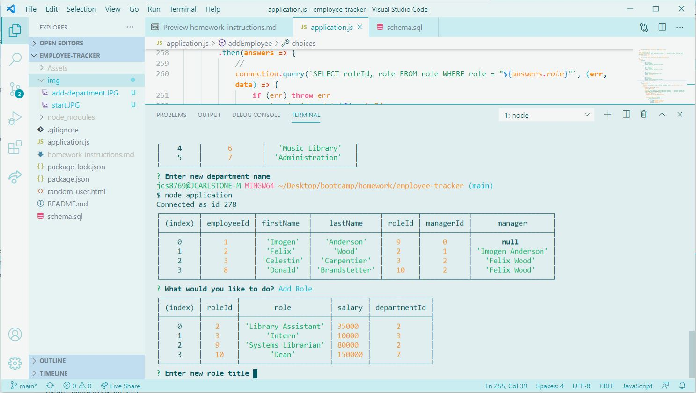
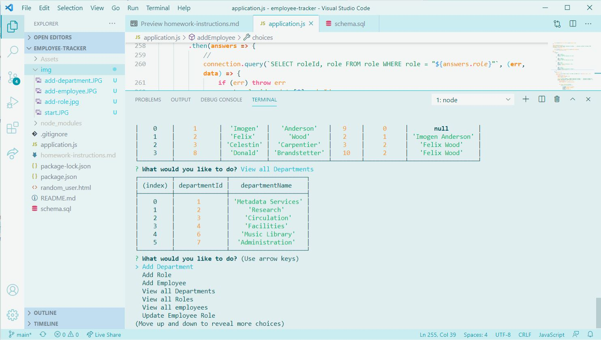

# Employee Tracker 
An application for keeping track of employees, departments, roles, and salaries.
https://github.com/jdcar/employee-tracker
https://drive.google.com/file/d/1VQe1xYK09A1n4QrRDGY16sJSzHBlprh4/view 
## Table of Contents
* [Description](#description)
* [Installation Instructions](#installation-instructions)
* [License](#license)
* [Questions](#questions)
* [Screenshots](#screenshots)
## Description
An app to keep track of employees, job titles, and departments.
## Installation Instructions
Follow these instructions or watch this video: https://drive.google.com/file/d/1VQe1xYK09A1n4QrRDGY16sJSzHBlprh4/view 
<ol>
<li>Clone the repository</li>
<li>Install packages using 'npm install' in the terminal</li>
<li>Run program using 'node application' or 'npm start' in terminal</li>
</ol>

## License
ISC. Copyright (c) 2021 Jamie Carlstone
## Questions
* https://github.com/jdcar
## Screenshots
* 
* 
* 
* 
* 
* 
* 
* 
