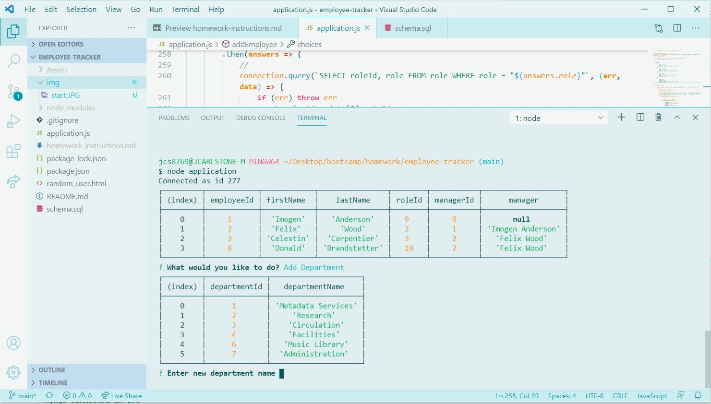
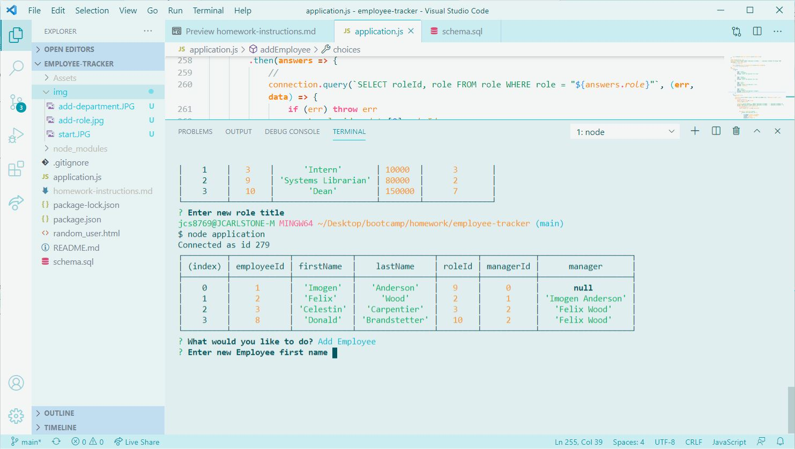
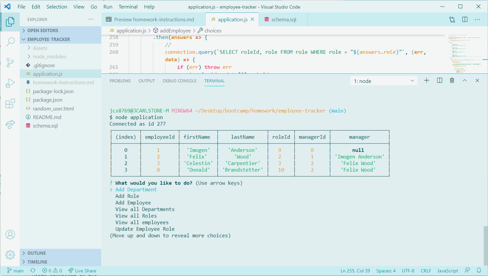
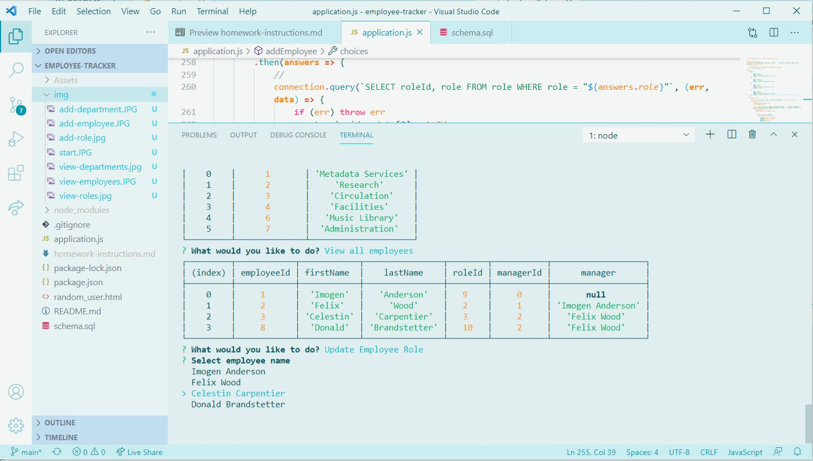
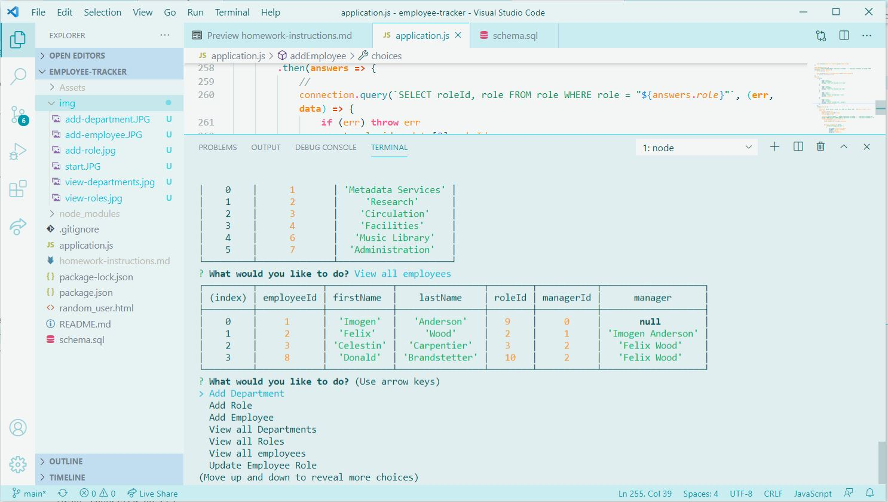

# Employee Tracker 
## Table of Contents
* [Description](#description)
* [Installation Instructions](#installation-instructions)
* [License](#license)
* [Questions](#questions)
* [Screenshots](#screenshots)
## Description
An app to keep track of employees, job titles, and departments.
## Installation Instructions

## License
ISC. Copyright (c) 2021 Jamie Carlstone
## Questions
* https://github.com/jdcar
## Screenshots
* 
* 
* 
* 
* 
* 
* 
* 
